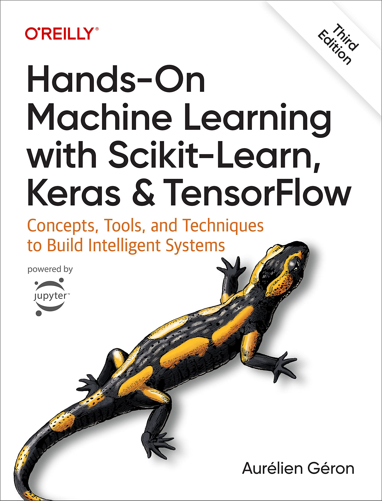

# Machine Learning Review

## About This Repository

This repository is dedicated to reviewing the core Machine Learning concepts that I have already applied throughout my professional career. The goal is to revisit the fundamentals with more structure, strengthen practical intuition, and consolidate best practices that are useful in real-world projects.

## Main Reference

The primary foundation of this study journey is the book:

**Hands-on Machine Learning with Scikit-learn and TensorFlow 2**

I will use this reference to review key ideas, reproduce examples, and explore the datasets presented in the book.

## What I Intend to Review

- Essential ML foundations (data preparation, model training, and evaluation)
- Classical supervised and unsupervised learning techniques
- Practical workflows using Scikit-learn
- Deep learning fundamentals and experimentation with TensorFlow 2
- Dataset exploration and interpretation of results from the book's examples

## Repository Purpose

This is a personal learning and consolidation space. The focus is on revisiting core theory through practical implementation, comparing approaches, and documenting insights while exploring the book's data and exercises.

## NCM Ranking Module (Practical Project)

The repository now also includes a practical NCM text-ranking project under `ncm/`, with:
- a complete ranking strategy diagram documented in `ncm/README.md`,
- an OOP ranking engine with tests and quality gates,
- a supervised refinement pipeline in `ncm/human_tuning/` for gradient-descent calibration using real human-validated labels from a 3-column Excel file.
